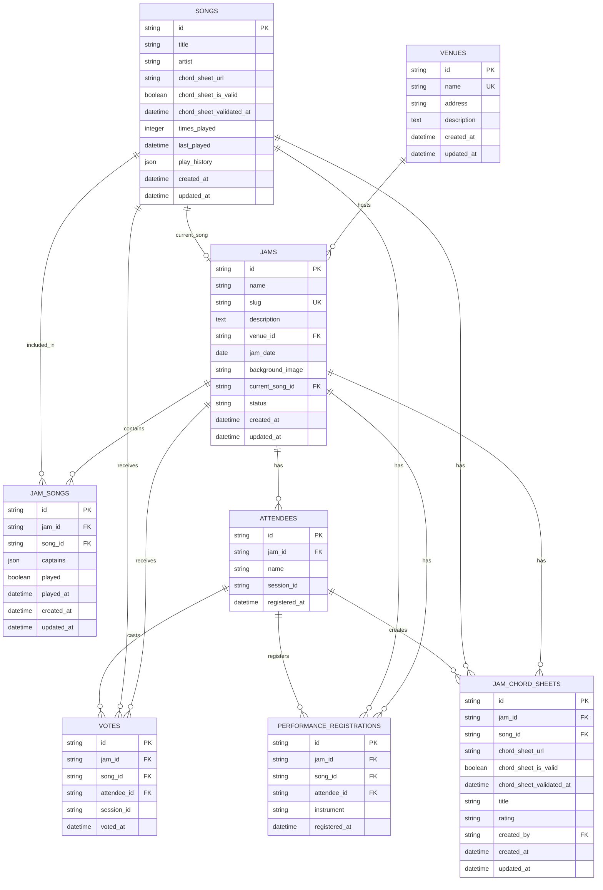

# JaManager Database Entity Relationship Diagram

## Overview

This document contains the complete Entity Relationship Diagram (ERD) for the JaManager database schema, showing all tables, relationships, and constraints.

## ERD Diagram

## Table Summary

| Table | Purpose | Key Features |
|-------|---------|--------------|
| **VENUES** | Venue information | Unique names, address/description |
| **JAMS** | Jam session management | Unique slugs, venue links, status tracking |
| **SONGS** | Master song library | Chord sheet URLs, play statistics |
| **JAM_SONGS** | Jam-song relationships | Junction table, play status |
| **ATTENDEES** | User registration | Session tracking, unique names per jam |
| **VOTES** | Voting system | Anonymous + registered voting |
| **PERFORMANCE_REGISTRATIONS** | Performance tracking | Instrument specification |
| **JAM_CHORD_SHEETS** | Chord sheet overrides | Jam-specific chord sheets |

## Key Relationships

### Core Relationships
- **Venues** host multiple **Jams**
- **Jams** contain multiple **Songs** (via JAM_SONGS)
- **Jams** have multiple **Attendees**
- **Attendees** can vote on **Songs** in **Jams**
- **Attendees** can register to perform on **Songs**

### Chord Sheet System
- **Songs** have default chord sheet URLs
- **JAM_CHORD_SHEETS** allows jam-specific chord sheet overrides
- **Attendees** can create chord sheet entries
- Validation status tracked for both default and jam-specific chord sheets

### Voting System
- Supports both anonymous (session-based) and registered (attendee-based) voting
- One vote per user per song per jam
- Real-time vote updates via WebSocket

## Constraints

### Unique Constraints
- `venues.name` - Unique venue names
- `jams.slug` - Unique jam slugs for URLs
- `attendees(jam_id, name)` - Unique attendee names per jam
- `jam_chord_sheets(jam_id, song_id)` - One chord sheet per song per jam

### Foreign Key Relationships
- All foreign keys maintain referential integrity
- Cascade deletes configured for dependent relationships
- Nullable foreign keys where appropriate (anonymous voting, optional current song)

## Data Types

- **IDs**: String (32-character hex tokens)
- **Timestamps**: DateTime with automatic creation/update
- **JSON Fields**: Used for flexible data (captains, play_history)
- **Boolean Fields**: For flags and validation status
- **Text Fields**: For longer descriptions and content

## Indexing Strategy

- Primary keys automatically indexed
- Unique constraints create indexes
- Foreign keys should be indexed for performance
- Consider composite indexes for common query patterns:
  - `(jam_id, song_id)` for votes and performance registrations
  - `(jam_id, attendee_id)` for attendee-specific queries
  - `(song_id, jam_id)` for song-specific queries

---

*This ERD represents the current database schema as of October 2025. For implementation details, see [TECHNICAL_ARCHITECTURE.md](./TECHNICAL_ARCHITECTURE.md).*
