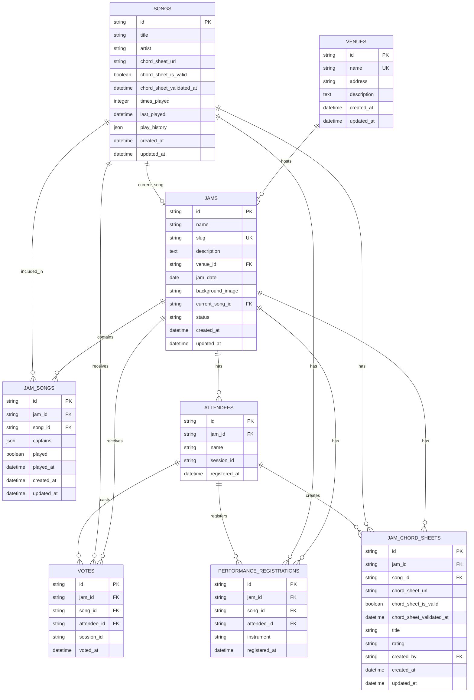

# JaManager Technical Architecture

## Database Architecture

### Entity Relationship Diagram (ERD)



### Database Schema Overview

#### Table Descriptions

**VENUES**
- Stores venue information where jam sessions take place
- Each venue can host multiple jam sessions
- Unique constraint on venue name

**JAMS**
- Core entity representing jam sessions
- Links to venues and tracks current song being played
- Unique slug for URL-friendly access
- Status tracking (waiting, playing, paused, ended)

**SONGS**
- Master song library with metadata
- Includes default chord sheet URLs and validation status
- Tracks play history and statistics
- Can be referenced by multiple jam sessions

**JAM_SONGS**
- Junction table linking jams to songs
- Tracks which songs are in each jam's queue
- Stores jam-specific metadata (captains, play status)
- Many-to-many relationship between jams and songs

**ATTENDEES**
- Users registered for specific jam sessions
- Tracks session IDs for browser session management
- Unique constraint on jam_id + name (one name per jam)

**VOTES**
- Individual votes cast for songs in jam sessions
- Supports both registered attendees and anonymous voting
- One vote per attendee/session per song

**PERFORMANCE_REGISTRATIONS**
- Tracks which attendees are registered to perform on specific songs
- Includes optional instrument specification
- One registration per attendee per song per jam

**JAM_CHORD_SHEETS**
- Jam-specific chord sheet overrides
- Allows different chord sheets for the same song in different jams
- Includes validation status and metadata from Ultimate Guitar
- Tracks who created each chord sheet entry

#### Key Relationships & Constraints

**Primary Relationships:**
- **Venues → Jams**: One-to-many (venue hosts multiple jams)
- **Jams ↔ Songs**: Many-to-many via JAM_SONGS junction table
- **Jams → Attendees**: One-to-many (jam has multiple attendees)
- **Jams → Votes**: One-to-many (jam receives multiple votes)
- **Songs → Votes**: One-to-many (song receives multiple votes)
- **Attendees → Votes**: One-to-many (attendee casts multiple votes)
- **Jams → Performance Registrations**: One-to-many
- **Songs → Performance Registrations**: One-to-many
- **Attendees → Performance Registrations**: One-to-many
- **Jams → Jam Chord Sheets**: One-to-many
- **Songs → Jam Chord Sheets**: One-to-many
- **Attendees → Jam Chord Sheets**: One-to-many (as creators)

**Unique Constraints:**
- `venues.name` - Unique venue names
- `jams.slug` - Unique jam slugs for URLs
- `attendees(jam_id, name)` - Unique attendee names per jam
- `jam_chord_sheets(jam_id, song_id)` - One chord sheet per song per jam

**Foreign Key Constraints:**
- All foreign keys properly defined with referential integrity
- Cascade deletes configured for dependent relationships
- Nullable foreign keys where appropriate (e.g., anonymous voting)

### Database Technology
- **Database Type:** SQLite (development) / PostgreSQL (production)
- **ORM:** SQLAlchemy with async support
- **Schema Management:** SQLAlchemy models, NOT raw SQL schema files
- **Migration Strategy:** SQLAlchemy model changes drive schema updates

### Key Architectural Decisions

#### Database Schema Management
- **CRITICAL:** The database uses SQLAlchemy models for schema definition, not raw SQL schema files
- All table creation, modifications, and relationships are defined in SQLAlchemy model classes
- Schema changes should be made by updating the model classes in `models/database.py`
- Database initialization scripts should use SQLAlchemy's `Base.metadata.create_all()` method
- **Never assume raw SQL schema files exist** - always use SQLAlchemy models

#### Database Initialization
- Development database is initialized with `init_dev_database.py` using SQLAlchemy models
- Database reset can be performed with `reset_dev_database.py`
- Default development database includes 30 popular cover songs with Ultimate Guitar URLs
- Sample data includes venues, jams, and jam-song relationships

#### Real-time Communication
- WebSocket connections managed by `ConnectionManager` class
- Real-time updates broadcast via `broadcast_to_jam()` method
- Message format: `{"event": "event_type", "data": {...}}`
- Supported events: `vote_update`, `performance_update`, `song_added`, `chord_sheet_update`

#### Session Management
- Browser sessions isolated using `sessionStorage` for `jam_session_id`
- User data persisted in `localStorage` for `jam_attendee`
- Session restoration checks both `jam_id` and `session_id` for security
- One attendee per jam per browser session

#### Chord Sheet Integration
- Ultimate Guitar API integration for chord sheet discovery
- Database-backed validation status (`chord_sheet_is_valid`, `chord_sheet_validated_at`)
- Jam-specific chord sheets stored in `jam_chord_sheets` table
- Default song chord sheets in `songs` table
- Real-time chord sheet updates via WebSocket

#### Frontend Architecture
- Vanilla JavaScript with modular class-based structure
- Global objects: `window.jamUI`, `window.jamAttendee`, `window.jamSongs`, `window.notificationSystem`
- Real-time updates handled by `jam-websocket.js`
- Modern notification system with auto-dismiss and progress bars

## File Structure

```
jamanager/
├── models/database.py          # SQLAlchemy models (schema definition)
├── core/database.py           # Database connection and session management
├── api/endpoints/             # FastAPI endpoints
├── static/                    # Frontend assets
│   ├── js/                   # JavaScript modules
│   └── css/                  # Stylesheets
├── init_dev_database.py       # Database initialization (SQLAlchemy)
├── reset_dev_database.py      # Database reset script
└── TECHNICAL_ARCHITECTURE.md  # This file
```

## Development Guidelines

### Database Changes
1. Update SQLAlchemy models in `models/database.py`
2. Test with `reset_dev_database.py` to ensure clean initialization
3. Never create raw SQL schema files
4. Use SQLAlchemy migrations for production schema changes

### Adding New Features
1. Define data models in `models/database.py`
2. Create API endpoints in `api/endpoints/`
3. Add frontend JavaScript modules in `static/js/`
4. Update WebSocket handlers for real-time features
5. Test with development database reset

### Real-time Features
1. Add WebSocket message handling in `jam-websocket.js`
2. Broadcast updates using `connection_manager.broadcast_to_jam()`
3. Update UI state in appropriate JavaScript modules
4. Test with multiple browser instances

## Common Pitfalls to Avoid

1. **Never assume raw SQL schema files exist** - always use SQLAlchemy models
2. Don't create database initialization scripts that depend on `.sql` files
3. Always use `Base.metadata.create_all()` for schema creation
4. Test database initialization with `reset_dev_database.py` after changes
5. Remember that session management requires both `jam_id` and `session_id` validation
6. WebSocket messages must follow the `{"event": "...", "data": {...}}` format

## Last Updated
2025-10-04 - Initial creation after discovering SQLAlchemy model-based architecture
